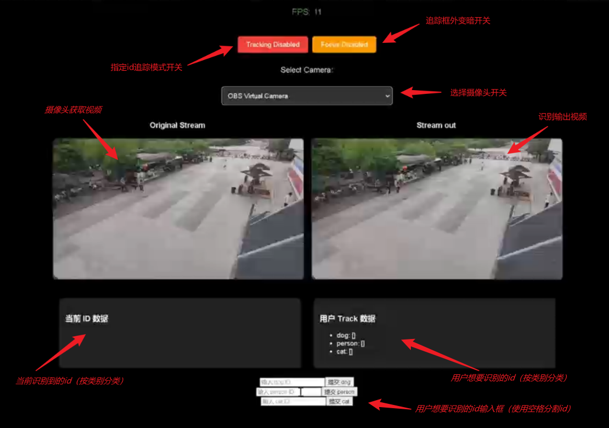
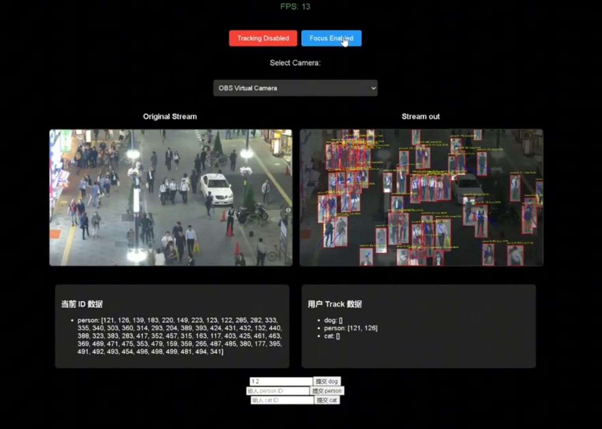
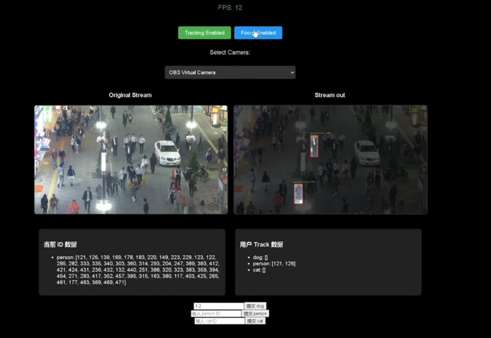
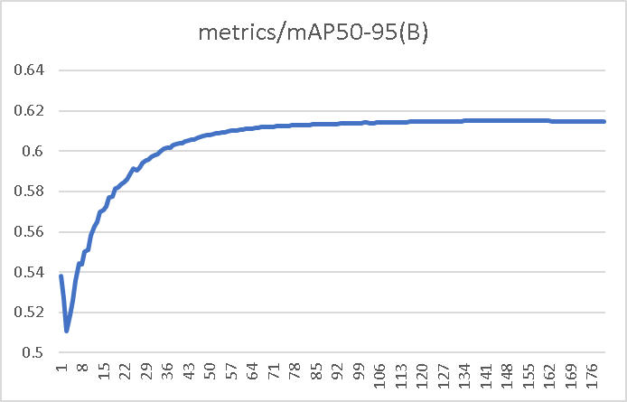
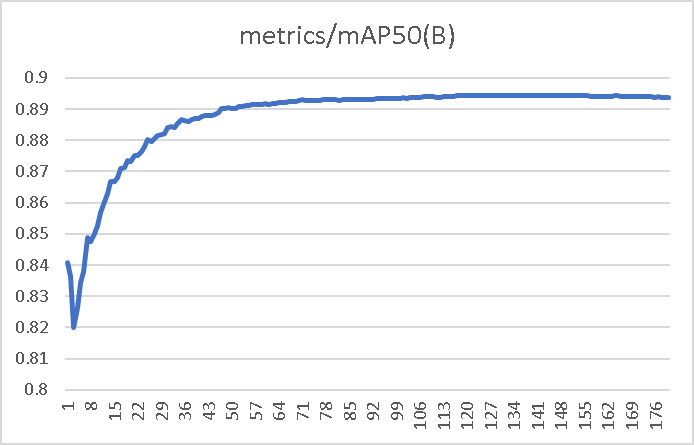
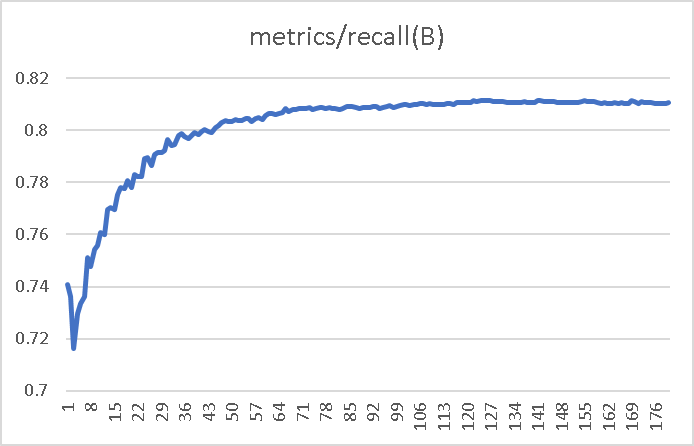

# RK3588_YOLOV8_BYTETRACK_MOT_WEB
A MOT project using YOLOV8 as the detection head and bytetrack as the tracker, deployed on RK3588S, with a web front-end built on Flask.

一个使用yolov8作为检测头，bytetrack作为追踪器，flask作为web前端的多目标追踪项目

---

## 演示视频

见 `project_demo.mp4`

## 界面&功能介绍

- 控件介绍
	

- 遮罩模式（追踪框外变暗）

	

- 指定id追踪模式
	

## 使用方法
- config.py
	OBJ_THRESH, NMS_THRESH：置信度，nms阈值
	IMG_SIZE：模型的输入大小
	TARGET_CLASSES：想要追踪的类别（以集合形式存储），其类别必须包在CLASSES中
	CLASSES：模型所支持的所有类别
	model：想使用的模型
- 运行方法
	创建新的conda环境，python=3.10
	安装 `environment` 文件夹下 `rknn_toolkit_lite2-2.0.0b0-cp310-cp310-linux_aarch64.whl` 包
	（`rknn_toolkit2-2.0.0b0+9bab5682-cp310-cp310-linux_x86_64.whl` 包为yolo模型转换rknn时使用的包）
	将 `librknnrt.so` 复制（覆盖）到 `/usr/lib/` 目录下
	执行 `pip install -r requirements.txt`
	运行 `python main_cam.py`
	在同一局域网下使用浏览器访问开发板的5000端口

## 训练日志

